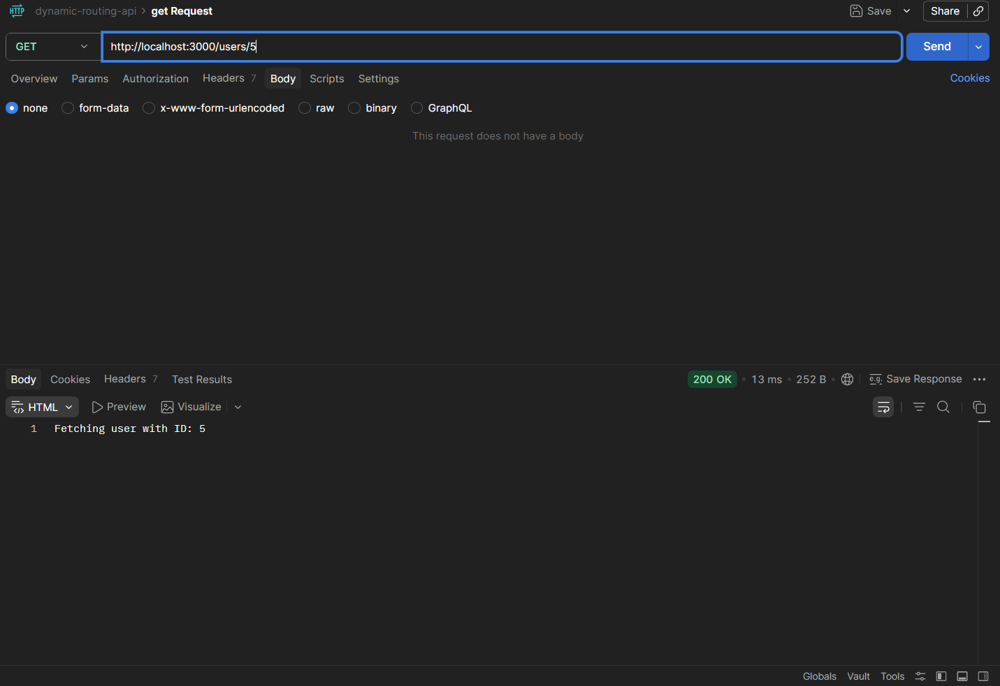
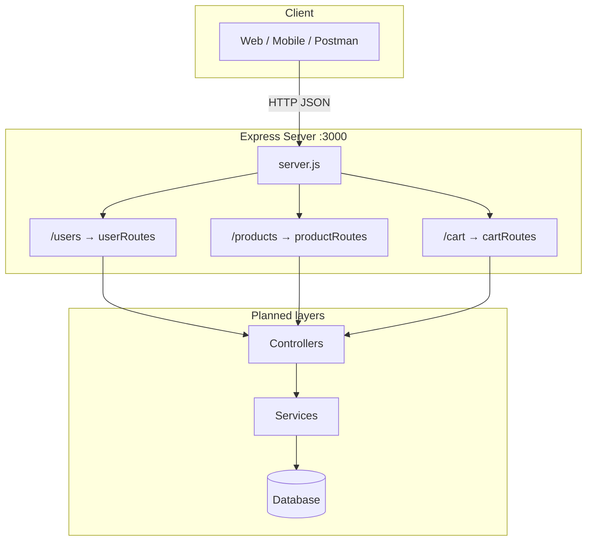
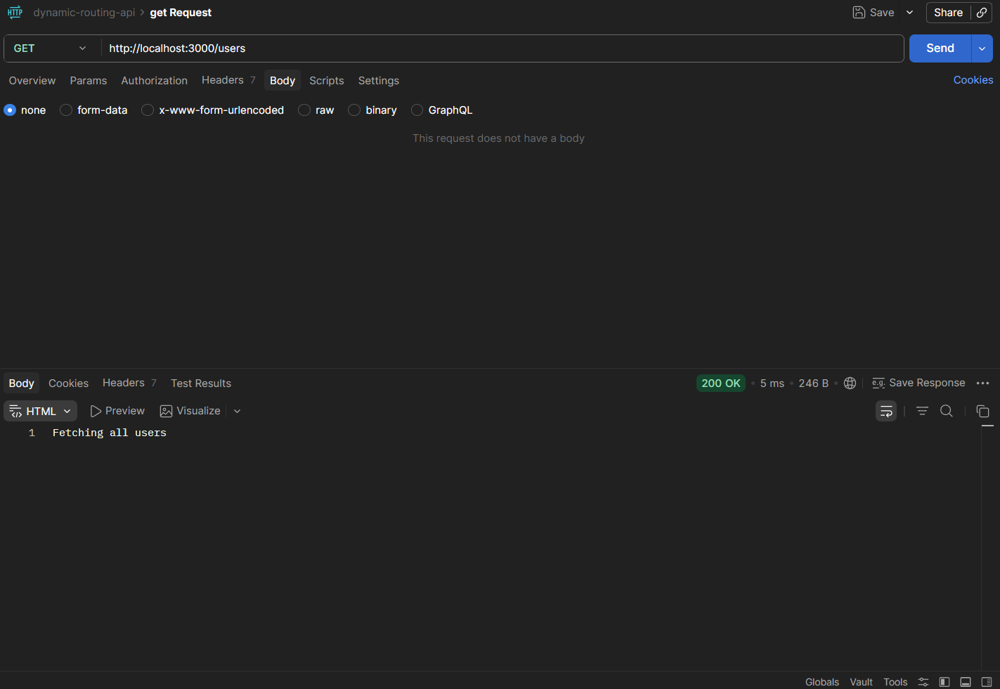
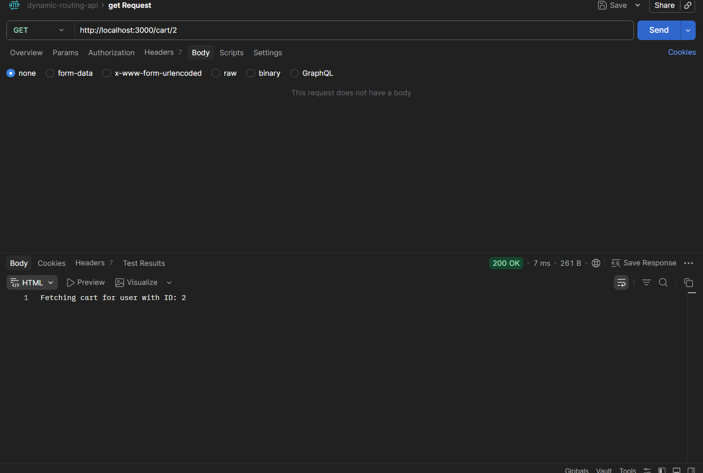

<h1 align="center">Ecommerce Startup API</h1>

<p align="center">
  A modular <strong>Node.js + Express</strong> REST API scaffold for users, products, and shopping carts — built for learning, interviews, and production-style growth.
</p>

<p align="center">
  
  
  
  
</p>


<p align="center">
  
</p>

---

## Table of contents

- [Overview](#overview)
- [Features](#features)
- [Architecture](#architecture)
- [Tech stack](#tech-stack)
- [Project structure](#project-structure)
- [Getting started](#getting-started)
- [API reference](#api-reference)
- [Example requests](#example-requests)
- [Roadmap](#roadmap)
- [Interview talking points](#interview-talking-points)
- [Contributing](#contributing)
- [License](#license)

---

## Overview

**Ecommerce Startup API** is a backend service that exposes REST endpoints for **users**, **products**, and **per-user carts**. The server uses Express middleware for JSON parsing and mounts feature routes under clear URL prefixes (`/users`, `/products`, `/cart`).

> **Current stage:** Route handlers return placeholder responses. The structure (separate route modules, centralized `server.js`) is production-oriented and ready for controllers, validation, persistence, and auth.

<p align="center">
  
  <br />
  <em>Add a screenshot at <code>docs/images/api-demo.png</code> after running the server.</em>
</p>

---

## Features

| Area | Status | Description |
|------|--------|-------------|
| REST routing | ✅ | Modular routers for users, products, cart |
| JSON body parsing | ✅ | `express.json()` enabled |
| Health / welcome | ✅ | `GET /` returns welcome message |
| Database | 🔜 | MongoDB / PostgreSQL (planned) |
| Auth (JWT) | 🔜 | Register, login, protected routes |
| Validation | 🔜 | Request schema validation (e.g. Zod/Joi) |
| Tests | 🔜 | Unit + integration (Jest/Supertest) |
| Docker / CI | 🔜 | Container + GitHub Actions |

---

## Architecture



<p align="center">
  
</p>
<p align="center">
  
</p>

**Request flow (today):**

1. Client sends HTTP request to Express.
2. `server.js` applies global middleware and mounts route modules.
3. Route handler responds (placeholder text until controllers/DB are added).

---

## Tech stack

| Layer | Technology |
|-------|------------|
| Runtime | Node.js |
| Framework | Express **5.x** |
| Module style | CommonJS (`require`) |
| API style | REST |

---

## Project structure

```
ecommerce-startup/
├── server.js              # App entry: middleware, route mounting, listen
├── routes/
│   ├── userRoutes.js      # User CRUD-style endpoints
│   ├── productRoutes.js   # Product catalog endpoints
│   └── cartRoutes.js      # Cart per userId
├── package.json
├── package-lock.json
└── docs/
    └── images/            # README assets (banner, diagrams, screenshots)
```

---

## Getting started

### Prerequisites

- [Node.js](https://nodejs.org/) **18+** (LTS recommended)
- npm (comes with Node)

### Installation

```bash
git clone https://github.com/<your-username>/ecommerce-startup.git
cd ecommerce-startup
npm install
```

### Run locally

```bash
node server.js
```

Server listens on **port 3000**:

```text
Server is running on port 3000
```

Open [http://localhost:3000](http://localhost:3000) — you should see the welcome HTML message.

### Environment variables (recommended next step)

Create `.env` (do not commit secrets):

```env
PORT=3000
NODE_ENV=development
# DATABASE_URL=
# JWT_SECRET=
```

Update `server.js` to use `process.env.PORT || 3000` when you add `dotenv`.

### Suggested npm scripts (add to `package.json`)

```json
"scripts": {
  "start": "node server.js",
  "dev": "node --watch server.js"
}
```

---

## API reference

Base URL: `http://localhost:3000`

### Root

| Method | Endpoint | Description |
|--------|----------|-------------|
| `GET` | `/` | Welcome message |

### Users (`/users`)

| Method | Endpoint | Description |
|--------|----------|-------------|
| `GET` | `/users` | List all users (placeholder) |
| `POST` | `/users` | Create user (placeholder) |
| `GET` | `/users/:id` | Get user by ID (placeholder) |

### Products (`/products`)

| Method | Endpoint | Description |
|--------|----------|-------------|
| `GET` | `/products` | List all products (placeholder) |
| `POST` | `/products` | Create product (placeholder) |
| `GET` | `/products/:id` | Get product by ID (placeholder) |

### Cart (`/cart`)

| Method | Endpoint | Description |
|--------|----------|-------------|
| `GET` | `/cart/:userId` | Get cart for user |
| `POST` | `/cart/:userId` | Add item to user's cart |

---

## Example requests

**Welcome**

```bash
curl http://localhost:3000/
```

**Users**

```bash
curl http://localhost:3000/users
curl -X POST http://localhost:3000/users -H "Content-Type: application/json" -d "{\"name\":\"Jane\"}"
curl http://localhost:3000/users/42
```

**Products**

```bash
curl http://localhost:3000/products
curl http://localhost:3000/products/101
```

**Cart**

```bash
curl http://localhost:3000/cart/42
curl -X POST http://localhost:3000/cart/42 -H "Content-Type: application/json" -d "{\"productId\":\"101\",\"qty\":2}"
```

---

## Roadmap

Production-minded milestones you can implement and mention in interviews:

- [ ] **Layered architecture:** routes → controllers → services → repositories  
- [ ] **Database:** persist users, products, cart lines  
- [ ] **Auth:** JWT + hashed passwords (bcrypt)  
- [ ] **Validation & errors:** consistent `{ success, data, error }` responses  
- [ ] **Security:** helmet, rate limiting, CORS  
- [ ] **Observability:** structured logging (pino/winston), health check `/health`  
- [ ] **Testing:** Supertest integration tests per route  
- [ ] **Deploy:** Docker + Render/Railway/Fly.io + GitHub Actions CI  

---

## Interview talking points

Use this repo to demonstrate **how you think about backend systems**, not only syntax:

1. **Separation of concerns** — Route files isolate domains (users vs products vs cart); next step is controllers so routes stay thin.  
2. **REST design** — Resource-oriented URLs; cart scoped by `userId` mirrors real e-commerce patterns.  
3. **Express middleware** — `express.json()` for body parsing; global vs route-level middleware.  
4. **Scalability path** — Stateless API → horizontal scaling behind a load balancer once sessions/JWT and DB are in place.  
5. **Trade-offs** — Placeholder handlers ship fast for learning; production needs validation, idempotency on cart updates, and transactional inventory.  
6. **What you’d do next** — Pick one vertical slice (e.g. `POST /products` with DB + tests) and complete it end-to-end — strong interview story.

---

## Contributing

1. Fork the repository  
2. Create a feature branch: `git checkout -b feature/amazing-feature`  
3. Commit changes with clear messages  
4. Open a Pull Request  

---

## License

This project is licensed under the **ISC** License — see `package.json`.

---

<p align="center">
  Built with Express · Ready to grow into a production e-commerce backend
</p>
